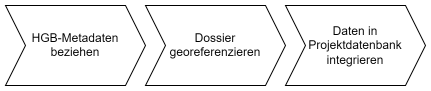

Dokumentation Projektdatenbank
==============


# 1 Einleitung
TODO
- Hinweis auf Projekt, in welchem diese Datenbank erstellt worden ist
- Ziel von diesem Dokument: Dokumentiert die im Projekt entwickelte Datenbank ("Projektdatenbank").
- Inhalt von diesem Dokument (Übersicht) 


# 2 Systemarchitektur
Für die Befüllung der Projektdatenbank werden Daten aus unterschiedlichen Quellen verarbeitet. Die folgende Grafik stellt der Datenfluss der benutzten Daten dar.


Folgende Stellen und Hilfsmittel sind am Datenfluss beteiligt:
- Das Staatsarchiv stellt Digitalisate sowie Metadaten des historischen Grundbuchs Basel (HGB) zur Verfügung.
- Auf der Transkribus Plattform wird das Layout analysiert und semantisch angereichert (Identifikation des Typs einer Textregion, beispielsweise Datumszeile, Quellenverweis oder Haupttext) und Texte automatisiert erkannt.
- Das Grundbuch- und Vermessungsamt ermittelt auf der Basis der Adresse pro HGB-Dossier einen geographischen Standort, insofern dies ermittelbar ist. 
- In der Projektdatenbank werden die für die Forschung zentralen Informationen gespeichert und zur Verfügung gestellt. Weitere Details zur Datenbank sind im nachfolgenden Kapitel [3 Modellbeschreibung](#3-modellbeschreibung) dokumentiert.

Zentrale Prozesse des Datenflusses sind in Kapitel [4 Prozesse](#4-prozesse) beschrieben.

Für den gesamten Datenfluss ist die Replizierbarkeit sichergestellt, da alle Prozesse über Skripte angestossen werden (u.a. mit Zugriff auf die API von Transkribus). Insbesondere wird die Projektdatenbank mit einem [Skript](https://github.com/history-unibas/Postgresql-Project-Database/blob/main/project_database_update.py) erstellt, befüllt und aktualisiert .


# 3 Modellbeschreibung
Die Projektdatenbank vereint Daten, die im Aufbereitungsprozess erstellt werden (aus Texterkennung und Layoutanalyse sowie folgenden Schritten) mit bereitgestellten Metadaten aus der archivischen Beschreibung (erarbeitet durch das Staatsarchiv Basel-Stadt).
Die Datenbank ist entsprechend sowohl hierarchisch aufgebaut (Abfragen von der Transkribus-Plattform beeinflussen darauffolgende Schritte) als auch eine Kombination mit Datenabfragen aus SPARQL.
Die Projektdatenbank ist unterteilt in folgende Gruppen von Entitäten:
- **StABS**: Die Entitäten enthalten Metadaten des HGB, basierend auf Daten des [Linked Open Data Portals](https://ld.bs.ch/).
- **Transkribus**: Entitäten dieser Gruppe enthalten ausgewählte Daten der Plattform [Transkribus](https://readcoop.eu/transkribus/), insbesondere Transkriptionen ausgewählter Digitalisate sowie Informationen zur Kategorisierung visueller Einheiten (Textregionen, die als "Paragraph"/"Quellenangabe"/"Titulatur" etc. definiert werden).
- **Geo**: Daten mit geographischer Informationen werden in Entitäten dieser Gruppe gespeichert.
- **Project**: Entitäten enthalten aufbereitete Daten basierend auf Daten aus den anderen Gruppen.

Das Präfix der Bezeichnung jeder Entität entspricht der Gruppenbezeichnung. In der nachfolgender Tabelle sind alle Entitäten aufgeführt. In Kapitel [4 Prozesse](#4-prozesse) werden die Entitäten genauer umschrieben.
| Bezeichnung | Bedeutung | Anzahl Elemente |
|--------|--------|--------|
| [StABS_Serie](#411-entität-stabs_serie) | Metadaten des HGB einer Strasse | 231 |
| [StABS_Dossier](#412-entität-stabs_dossier) | Metadaten des HGB einer Adresse, Gebäude oder weitere Informationen | 6'056 |
| [StABS_Page](TODO) TODO | TODO | 193'406 |9
| [StABS_Klingental_Regest](#413-entität-stabs_klingental_regest) | Metadaten zu Klosterurkunden des Klosters Klingental | 2'803 |
| [Transkribus_Collection](#421-entität-transkribus_collection) | Daten von Transkribus einer Strasse | 207 |
| [Transkribus_Document](#422-entität-transkribus_document) | Daten von Transkribus einer Adresse, Gebäude oder weitere Informationen | 6'057 |
| [Transkribus_Page](#423-entität-transkribus_page) | Daten von Transkribus eines Digitalisats | 193'409 |
| [Transkribus_Transcript](#424-entität-transkribus_transcript) | Daten von Transkribus einer Transkriptions-Version | 751'078 |
| [Transkribus_TextRegion](#425-entität-transkribus_textregion) | Daten von Transkribus einer transkribierten Textregion | 607'769 |
| [Geo_Address](#431-entität-geo_address) | Geographische Standorte von HGB-Dossier | 3'785 |
| [Project_Dossier](#441-entität-project_dossier) | Aufbereitete Informationen zu Adressen | 4'347 |
| [Project_Entry](#442-entität-project_entry) | Aufbereitete Informationen zu HGB-Einträgen | 125'405 |
| [Project_Period](#443-entität-project_period) | Gültigkeitszeiträume der Dossier | 4'724 |
| [Project_Relationship](#444-entität-project_relationship) | Aufbereitete Beziehungen zwischen Dossier | 2'176 |

Die folgende Grafik zeigt, wie diese Entitäten in Beziehung gesetzt werden können. Lesebeispiel für die Beziehung zwischen StABS_Serie und StABS_Dossier: Ein Element der Entität StABS_Serie ist verbunden zu einem oder mehreren Elementen der Entität StABS_Dossier. Umgekehrt, ein Element der Entität StABS_Dossier ist mit genau einem Element der Entität StABS_Serie verbunden.


Eine formale Beschreibung der Entitäten in der Datenbank ist im [Readme des Github-Repositories](https://github.com/history-unibas/Postgresql-Project-Database/blob/main/README.md#database-schema) dokumentiert. 


# 4 Prozesse
Dieses Kapitel dokumentiert pro Gruppe von Entitäten die Aufbereitung der Daten aus dem HGB:
- Gruppe StABS: [4.1 HGB-Metadaten in Projektdatenbank integrieren](#41_hgb-metadaten_in_projektdatenbank_integrieren)
- Gruppe Transkribus: [4.2 Verarbeitung der Digitalisate](#42_verarbeitung_der_digitalisate)
- Gruppe Geo: [4.3 HGB-Dossier georeferenzieren](#43_hgb-dossier_georeferenzieren)
- Gruppe Project: [4.4 Anreicherung von Daten](#44_anreicherung_von_daten)


## 4.1 HGB-Metadaten in Projektdatenbank integrieren
Das Staatsarchiv Basel-Stadt (StABS) stellt via des [Linked Open Data Portals](https://ld.bs.ch/) Metadaten zum HGB zur Verfügung. Mithilfe eines [Skripts](https://github.com/history-unibas/Postgresql-Project-Database/blob/main/project_database_update.py) werden Metadaten des HGB gelesen und in der Projektdatenbank als Entitäten [StABS_Serie](#411-entität-stabs_serie) und [StABS_Dossier](#412-entität-stabs_dossier) gespeichert. Zusätzlich werden Metadaten zu Klosterurkunden des Klosters Klingental in der Entität [StABS_Klingental_Regest](#413-entität-stabs_klingental_regest) geschrieben.


### 4.1.1 Entität StABS_Serie

#### 4.1.1.1 Bedeutung
Elemente der Entität StABS_Serie ("Serie") repräsentieren Strassen. Das Staatsarchiv hat diese Elemente als Stufe "Serie" klassiert.

#### 4.1.1.2 Entstehung
Metadaten zu Serien wurden mithilfe folgender Query bezogen:

```
PREFIX rico: <https://www.ica.org/standards/RiC/ontology#>
        SELECT ?link ?identifier ?title
        WHERE {
            {
            ?link rico:identifier ?identifier ;
            rico:title ?title ;
            rico:type "Akte"@ger ;
            rico:isDirectlyIncludedIn <https://ld.bs.ch/ais/Record/1027330> .
            }
        }
```
Dabei entspricht die URI https://ld.bs.ch/ais/Record/1027330 dem HGB 1-Bestand.

#### 4.1.1.3 Spezialfälle
Gewisse Serien haben keine zugehörige Dossiers (Objekte der Entität [StABS_Dossier](#412-entität-stabs_dossier)). Im Attribut "title" haben diese Serien den Präfix "[leer]".

#### 4.1.1.4 Fehler
Bei der Datenaufbereitung wurden einzelne Fehler entdeckt und durch das Staatsarchiv korrigiert.

#### 4.1.1.5 Beschreibung der Attribute

| serieId |  |
|--------|--------|
| Bedeutung | Projekt-Identifikator einer Serie. |
| Entstehung | Direkt abgeleitet aus der stabsId, ohne Leerzeichen und Vereinheitlichung der Anzahl Charakter. |
| Spezialfälle | - |
| Statistik | - |

| stabsId |  |
|--------|--------|
| Bedeutung | Durch das Staatsarchiv definierter Identifikator einer Serie. |
| Entstehung | - |
| Spezialfälle | - |
| Statistik | - |

| title |  |
|--------|--------|
| Bedeutung | Titel der Serie, üblicherweise eine oder mehrere Strasse- oder Ortsbezeichnung. |
| Entstehung | - |
| Spezialfälle | Serien ohne zugehörige Dossier (Objekte der Entität [StABS_Dossier](#412-entität-stabs_dossier)) besitzen Präfix "[leer]". |
| Statistik | - |

| link |  |
|--------|--------|
| Bedeutung | URI des entsprechenden Eintrags im Linked Data Portal Basel-Stadt. |
| Entstehung | - |
| Spezialfälle |  |
| Statistik |  |


### 4.1.2 Entität StABS_Dossier

#### 4.1.2.1 Bedeutung
Elemente der Entität StABS_Dossier ("Dossier") repräsentieren Gebäude, Adressen, Teile eines Gebäudes sowie weitere Objekte oder Informationen zu einer bestimmten Strasse. Das Staatsarchiv hat diese Elemente als Stufe "Dossier" klassiert.

#### 4.1.2.2 Entstehung
Metadaten zu Dossier wurden mithilfe folgender Query bezogen, wobei der Parameter LINK_SERIE die URI der verknüpften Serie eingesetzt wird:

```
PREFIX rico: <https://www.ica.org/standards/RiC/ontology#>
        PREFIX stabs-rico:
            <https://ld.bs.ch/ontologies/StABS-RiC/>
        SELECT ?link ?identifier ?title ?note ?housenamebs ?oldhousenumber
            ?owner1862
            WHERE {{
                    {{
                    ?link rico:identifier ?identifier ;
                    rico:title ?title ;
                    rico:type "Akte"@ger ;
                    rico:isDirectlyIncludedIn <{LINK_SERIE}> .
                    }}
                OPTIONAL {{?link rico:generalDescription ?note .}}
                OPTIONAL {{?link stabs-rico:houseNameBS ?housenamebs .}}
                OPTIONAL {{?link stabs-rico:oldHousenumber ?oldhousenumber .}}
                OPTIONAL {{?link stabs-rico:owner1862 ?owner1862 .}}
            }}
```

#### 4.1.2.3 Spezialfälle
keine Anmerkung.

#### 4.1.2.4 Fehler
Bei der Datenaufbereitung wurden einzelne Fehler entdeckt und durch das Staatsarchiv korrigiert.

#### 4.1.2.5 Beschreibung der Attribute

| dossierId |  |
|--------|--------|
| Bedeutung | Projekt-Identifikator eines Dossier. |
| Entstehung | Direkt abgeleitet aus StABS_Dossier.stabsId, ohne Leerzeichen und Vereinheitlichung der Anzahl Charakter. |
| Spezialfälle | - |
| Statistik | - |

| serieId |  |
|--------|--------|
| Bedeutung | Identifikator der zugehörigen Serie (Attribut 'StABS_Serie.serieId') |
| Entstehung | - |
| Spezialfälle | - |
| Statistik | - |

| stabsId |  |
|--------|--------|
| Bedeutung | Durch das Staatsarchiv definierter Identifikator eines Dossier. |
| Entstehung | - |
| Spezialfälle | - |
| Statistik | - |

| title | TODO | 
|--------|--------|
| Bedeutung | Title of the dossier, often correspondend to the address according to the address book of 1862 |
| Entstehung |  |
| Spezialfälle |  |
| Statistik |  |

| link |  |
|--------|--------|
| Bedeutung | URI of the linked open data entry of the State Archives |
| Entstehung |  |
| Spezialfälle |  |
| Statistik |  |

| houseName |  |
|--------|--------|
| Bedeutung | Name of the house |
| Entstehung |  |
| Spezialfälle |  |
| Statistik |  |

| oldHousenumber |  |
|--------|--------|
| Bedeutung | Old house number |
| Entstehung |  |
| Spezialfälle |  |
| Statistik |  |

| owner1862 |  |
|--------|--------|
| Bedeutung | Owner of the house in the year 1862 |
| Entstehung |  |
| Spezialfälle |  |
| Statistik |  |

| descriptiveNote |  |
|--------|--------|
| Bedeutung | Remarks |
| Entstehung |  |
| Spezialfälle |  |
| Statistik |  |


### 4.1.3 Entität StABS_Klingental_Regest

#### 4.1.3.1 Bedeutung
This entity contains metadata from the State Archives on the "Regesten Klingental" series.

#### 4.1.3.2 Entstehung


#### 4.1.3.3 Spezialfälle


#### 4.1.3.4 Fehler


#### 4.1.3.5 Beschreibung der Attribute

| link |  |
|--------|--------|
| Bedeutung | URI of the linked open data entry of the State Archives |
| Entstehung |  |
| Spezialfälle |  |
| Statistik |  |

| identifier |  |
|--------|--------|
| Bedeutung | Identifier of the State Archives |
| Entstehung |  |
| Spezialfälle |  |
| Statistik |  |

| title |  |
|--------|--------|
| Bedeutung | Title of the document |
| Entstehung |  |
| Spezialfälle |  |
| Statistik |  |

| descriptiveNote |  |
|--------|--------|
| Bedeutung | Remarks |
| Entstehung |  |
| Spezialfälle |  |
| Statistik |  |

| expressedDate |  |
|--------|--------|
| Bedeutung | Expressed date of the document |
| Entstehung |  |
| Spezialfälle |  |
| Statistik |  |


## 4.2 Verarbeitung der Digitalisate
TODO
- Prozess beschreiben (https://drive.switch.ch/index.php/f/6566052981) -> Transkribus
- inkl. Paper, Kapitel 5

### 4.2.1 Entität Transkribus_Collection

#### 4.2.1.1 Bedeutung
Elements of the Transkribus_Collection entity represent a street and are stored as collection on Transkribus.

#### 4.2.1.2 Entstehung


#### 4.2.1.3 Spezialfälle


#### 4.2.1.4 Beschreibung der Attribute

| colId |  |
|--------|--------|
| Bedeutung | Identifier Transkribus collection (UUID) |
| Entstehung |  |
| Spezialfälle |  |
| Fehler |  |
| Statistik |  |

| colName |  |
|--------|--------|
| Bedeutung | Name of the collection, correspond to StABS_Serie.serieId |
| Entstehung |  |
| Spezialfälle |  |
| Fehler |  |
| Statistik |  |

| nrOfDocuments |  |
|--------|--------|
| Bedeutung | Number of documents linked to the collection |
| Entstehung |  |
| Spezialfälle |  |
| Fehler |  |
| Statistik |  |


### 4.2.2 Entität Transkribus_Document

#### 4.2.2.1 Bedeutung
Elements of the Transkribus_Document entity represent a building or address. On Transkribus, they are stored as documents.

#### 4.2.2.2 Entstehung


#### 4.2.2.3 Spezialfälle


#### 4.2.2.4 Beschreibung der Attribute

| docId |  |
|--------|--------|
| Bedeutung | Identifier Transkribus document (UUID) |
| Entstehung |  |
| Spezialfälle |  |
| Fehler |  |
| Statistik |  |

| colId |  |
|--------|--------|
| Bedeutung | Identifier to the linked collection |
| Entstehung |  |
| Spezialfälle |  |
| Fehler |  |
| Statistik |  |

| title |  |
|--------|--------|
| Bedeutung | Title of the Document, correspond to StABS_Dossier.dossierId. In particular cases there is no entry in StABS_Dossier. |
| Entstehung |  |
| Spezialfälle |  |
| Fehler |  |
| Statistik |  |

| nrOfPages |  |
|--------|--------|
| Bedeutung | Number of pages linked to the document |
| Entstehung |  |
| Spezialfälle |  |
| Fehler |  |
| Statistik |  |


### 4.2.3 Entität Transkribus_Page

#### 4.2.3.1 Bedeutung
Documents on Transkribus can contain several pages. Each element of the entity Transkribus_Page represent one page on Transkribus respectively a page of a file card of the historical land registry.

#### 4.2.3.2 Entstehung


#### 4.2.3.3 Spezialfälle


#### 4.2.3.4 Beschreibung der Attribute

| pageId |  |
|--------|--------|
| Bedeutung | Identifier Transkribus page (UUID) |
| Entstehung |  |
| Spezialfälle |  |
| Fehler |  |
| Statistik |  |

| key |  |
|--------|--------|
| Bedeutung | Key of the page (UUID) |
| Entstehung |  |
| Spezialfälle |  |
| Fehler |  |
| Statistik |  |

| docId |  |
|--------|--------|
| Bedeutung | Identifier to the linked document |
| Entstehung |  |
| Spezialfälle |  |
| Fehler |  |
| Statistik |  |

| pageNr |  |
|--------|--------|
| Bedeutung | Page number in the document |
| Entstehung |  |
| Spezialfälle |  |
| Fehler |  |
| Statistik |  |

| urlImage |  |
|--------|--------|
| Bedeutung | URI of the image of the page stored in Transkribus |
| Entstehung |  |
| Spezialfälle |  |
| Fehler |  |
| Statistik |  |

| entryId |  |
|--------|--------|
| Bedeutung | Identifier to Project_Entry.entryId |
| Entstehung |  |
| Spezialfälle |  |
| Fehler |  |
| Statistik |  |


### 4.2.4 Entität Transkribus_Transcript

#### 4.2.4.1 Bedeutung
Transcriptions of a page are saved as page xml on Transkribus. Each time a change is made on Transkribus, a new version is generated. Elements of the entity Transkribus_Transcript represent selected information of a page xml.

#### 4.2.4.2 Entstehung


#### 4.2.4.3 Spezialfälle


#### 4.2.4.4 Beschreibung der Attribute

| key |  |
|--------|--------|
| Bedeutung | Key of the transcription |
| Entstehung |  |
| Spezialfälle |  |
| Fehler |  |
| Statistik |  |

| tsId |  |
|--------|--------|
| Bedeutung | 	Identifier Transkribus transcript (UUID) |
| Entstehung |  |
| Spezialfälle |  |
| Fehler |  |
| Statistik |  |

| pageId |  |
|--------|--------|
| Bedeutung | Identifier to the linked page |
| Entstehung |  |
| Spezialfälle |  |
| Fehler |  |
| Statistik |  |

| parentTsId |  |
|--------|--------|
| Bedeutung | Identifier of the previous transcription version |
| Entstehung |  |
| Spezialfälle |  |
| Fehler |  |
| Statistik |  |

| urlPageXml |  |
|--------|--------|
| Bedeutung | URI to the page xml of the transcription |
| Entstehung |  |
| Spezialfälle |  |
| Fehler |  |
| Statistik |  |

| status |  |
|--------|--------|
| Bedeutung | Defined status of the transcription. Possible values: NEW, IN_PROGRESS, DONE, FINAL, GROUND_TRUTH |
| Entstehung |  |
| Spezialfälle |  |
| Fehler |  |
| Statistik |  |

| timestamp |  |
|--------|--------|
| Bedeutung | Time of transcription, Unix time stamp in milliseconds since 01.01.1970 UTC |
| Entstehung |  |
| Spezialfälle |  |
| Fehler |  |
| Statistik |  |

| htrModel |  |
|--------|--------|
| Bedeutung | Type of HTR model used for the transcription |
| Entstehung |  |
| Spezialfälle |  |
| Fehler |  |
| Statistik |  |


### 4.2.5 Entität Transkribus_TextRegion

#### 4.2.5.1 Bedeutung


#### 4.2.5.2 Entstehung


#### 4.2.5.3 Spezialfälle


#### 4.2.5.4 Beschreibung der Attribute

| textRegionId |  |
|--------|--------|
| Bedeutung | Transcriptions of texts are stored on Transkribus within the page xmls in text regions. Each element of the Transkribus_TextRegion entity represents a non-empty text region of an element of the Transkribus_Transcript entity. |
| Entstehung |  |
| Spezialfälle |  |
| Fehler |  |
| Statistik |  |

| key |  |
|--------|--------|
| Bedeutung | Generated text region identifier according to the following structure: {key}_{int(index):02} (UUID) |
| Entstehung |  |
| Spezialfälle |  |
| Fehler |  |
| Statistik |  |

| index | Key of the transcription |
|--------|--------|
| Bedeutung | Index of the text region |
| Entstehung |  |
| Spezialfälle |  |
| Fehler |  |
| Statistik |  |

| type |  |
|--------|--------|
| Bedeutung | Type assigned to the text region. Examples: marginalia, header, paragraph, credit, footer  |
| Entstehung |  |
| Spezialfälle |  |
| Fehler |  |
| Statistik |  |

| textLine |  |
|--------|--------|
| Bedeutung | Transcribed text per line saved as a list |
| Entstehung |  |
| Spezialfälle |  |
| Fehler |  |
| Statistik |  |

| text |  |
|--------|--------|
| Bedeutung | Entire transcribed text of the text region, indexed in the database |
| Entstehung |  |
| Spezialfälle |  |
| Fehler |  |
| Statistik |  |


## 4.3 HGB-Dossier georeferenzieren
Um Erkenntnisse aus dem HGB räumlich analysieren zu können und Ergebnisse im Raum darzustellen, soll jedes für das Projekt relevante Dossier räumlich verortet werden. Zur Erreichung dieses Ziels, wurde in einem ersten Schritt HGB-Dossier durch das [Grundbuch- und Vermessungsamt des Kantons Basel-Stadt](https://www.bs.ch/bvd/grundbuch-und-vermessungsamt) georeferenziert. Dieser Prozess wird in diesem Kapitel beschrieben. Im zweiten Schritt wurde im Rahmen des Projekts weitere geographische Standorte ermittelt sowie Standorte verbessert. Dieser Prozess ist in Kapitel [4.4.1.4 Beschreibung der Attribute](#4414-beschreibung-der-attribute) in den Attributen 'location' und 'locationShifted' dokumentiert.


### 4.3.1 Entität Geo_Address
TODO Benjamin: Ist es sinnvoll, Inhalte aus deinem Workshop-Paper (https://drive.switch.ch/index.php/f/6566228811) in dieses Kapitel zu integrieren? -> ist m.E. nicht unbedingt nötig.

#### 4.3.1.1 Bedeutung
Jeder Eintrag der Entität Geo_Address repräsentiert ein HGB-Dossier und beinhaltet der geographische Standort des im Dossier abgebildeten Gebäudes als Punktgeometrie. 

Elements contained in this entity represent the spatial location of HGB dossiers. Not all dossiers are included. Currently, this entity is generated based on a shapefile including all attributes contained therein. The elements of the Geo_Address table are linked as follows using geo_address.signature = stabs_dossier.stabsid.

#### 4.3.1.2 Entstehung
TODO Benjamin: Sind hier weitere Details zur Aufbereitung von Andreas notwendig? Allenfalls kann ich diese aus Notizen herausnehmen oder werde ihn fragen. -> das wäre sicher schön, aber vielleicht auch ein wenig zu weit gehend, weil wir sowieso schwer nachvollziehen können, wie er vorging.

Die Georeferenzierung von HGB-Dossiers kann durch folgende Teilprozesse beschrieben werden.



- **HGB-Metadaten beziehen**: Mithilfe des [Linked Data Portal Basel-Stadt](https://ld.bs.ch/) werden Metadaten zum HGB bezogen.
- **Dossier georeferenzieren**: Auf Basis eines Datensatzes von geolokalisierten historischen Adressen der Stadt Basel und den HGB-Metadaten ("Titel" und "Alte Hausnummer") hat das Grundbuch- und Vermessungsamt mit einem [FME-Skript](https://fme.safe.com/) eine Shape-Datei erstellt. Ein HGB-Dossier wird durch einen Punkt im Koordinatensystem LV95 ([EPSG:2056](https://epsg.io/2056)) repräsentiert.
- **Daten in Projektdatenbank integrieren**: Mithilfe eines [Skript](https://github.com/history-unibas/Postgresql-Project-Database/blob/main/project_database_update.py) werden die Daten der Shape-Datei gelesen und in der Projektdatenbank gespeichert.

#### 4.3.1.3 Spezialfälle
Umfasst ein HGB-Dossier mehr als eine Hausnummer, wird für die Geolokalisierung die erste Hausnummer verwendet.

Viele HGB-Dossier konnten in diesem Prozess nicht geolokalisiert werden:
- Für 997 Dossier existiert keine Hausnummer in den Metadaten, beispielsweise weil das Dossier Personenregister enthaltet.
- 632 Dossier konnten nicht einer alten Hausnummer zugeordnet werden. Dies betrifft teilweise alte Hausnummern, welche im Adressverzeichnis von 1862 nicht mehr existieren oder Eigenkreationen von den Verfassern des HGB sind.
- Für 416 Dossier fehlte eine "neue" Adresse, das heisst Adressen nach 1862. Diese Dossier beinhalten meistens nur Brandlagerbücher.
- Für 227 Dossier ist der Grund nicht bekannt.

#### 4.3.1.4 Fehler
Bei einzelnen Metadaten wurden Fehler in den Adressen festgestellt. Beispiele: falsch erfasste Attribute, Fehler in Gross-/Kleinschreibung, Hausnummer "4/6" statt "416". Das Staatsarchiv wurde über diese Fehler informiert.

TODO Benjamin: Kannst du eine Aussage über die Genauigkeit der Daten von Andreas machen? -> Leider nein. Die Daten des Vermessungsamtes basieren vornehmlich auf den alten Hausnummern, und deshalb ist die zum Teil feinere Gliederung, die das Adressverzeichnis von 1862 aufweist, nicht abgebildet.

#### 4.3.1.5 Statistik
Von den 6'057 HGB-Dossier, über welche Metadaten verfügbar sind, konnten im Rahmen dieser Geolokalisierung für 3'785 Dossier einen Standort ermittelt werden. Es existieren Dossier, welche denselben Standort besitzen.

#### 4.3.1.6 Beschreibung der Attribute
Die vom Grundbuch- und Vermessungsamt erhaltene Shape-Datei wird ohne Veränderung der Attribute in die Projektdatenbank übernommen. Diese Attribute enthalten Metadaten des Staatsarchivs sowie während der Georeferenzierung gespeicherte Zwischenschritte. Im Projekt wird ausschliesslich die Signatur (entspricht dem Attribut 'StABS_Dossier.stabsId') sowie die Punktgeometrie (im Koordinatensystem EPSG:2056) weiterverwendet. Aus diesem Grund wird auf eine genaue Beschreibung der Attribute verzichtet.


## 4.4 Anreicherung von Daten
Auf Basis der Entitäten der Gruppen "StABS", "Transkribus" und "Geo" ([3 Modellbeschreibung](#3-modellbeschreibung)) wurden die Entitäten der Gruppe "Project" iterativ mithilfe von Skripts und manueller Bearbeitung entwickelt.

### 4.4.1 Entität Project_Dossier

#### 4.4.1.1 Bedeutung
Jedes Element dieser Entität ("Dossier") repräsentiert ein Dossier im Historisches Grundbuch der Stadt Basel (HGB). Alle Dossier sind ebenfalls in der Tabelle StABS_Dossier abgebildet.

Elements of the Project_Dossier table represent a dossier of HGB analogous to the elements in the entity StABS_Dossier. Only dossiers relevant to our project are mapped in this entity. This means dossiers that are referenced in the Project_Dossier entity.

#### 4.4.1.2 Entstehung
Es werden ausschliesslich Dossier in dieser Entität abgebildet, welche mindestens einen Eintrag in der Entität Project_Entry mit Bezug zum entsprechenden Dossier besitzt.

#### 4.4.1.3 Spezialfälle
Üblicherweise repräsentiert ein Dossier ein Gebäude. Spezielle Dossier enthalten im Attribut "specialType" einen Wert.

#### 4.4.1.4 Beschreibung der Attribute

| dossierId |  |
|--------|--------|
| Bedeutung | Identifikator des Dossiers |
| Entstehung | Die dossierId ist abgeleitet von StABS_Dossier.stabsId, welcher der Signatur des Staatsarchivs entspricht. |
| Spezialfälle | - |
| Fehler | - |
| Statistik | - |

| locationAccuracy |  |
|--------|--------|
| Bedeutung | Für in diesem Projekt manuell gesetzte Standorte (Attribut 'location') wird in diesem Attribut eine Aussage gemacht, wie genau dieser Standort definiert werden konnte. Standorte auf Basis von Standorten des Grundbuch- und Vermessungsamt sind als "unbekannt" gekennzeichnet, Dossier ohne Standorte als "nicht lokalisierbar". |
| Entstehung | siehe Entstehung des Attributs 'location' |
| Spezialfälle | - |
| Fehler | - |
| Statistik | unbekannt: 3'475<br>genau gesetzt: 397<br>ungefähre Ortsangabe: 328<br>ungefähr gesetzt: 123<br>grob geschätzt: 18<br>nicht lokalisierbar: 6 |

| locationOrigin |  |
|--------|--------|
| Bedeutung | Dieses Attribut beschreibt, auf welcher Basis der Standort des Dossier (Attribut 'location') entstanden ist. |
| Entstehung | siehe Entstehung des Attributs 'location' |
| Spezialfälle | - |
| Fehler | - |
| Statistik | Grundbuch- und Vermessungsamt Basel-Stadt: 3'089<br>manuell gesetzt: 866<br>mithilfe von Skript generiert basierend auf Standorte von Grundbuch- und Vermessungsamt: 306<br>manuell geprüft: 80<br>[NULL]: 6 |

TODO Benjamin:
- Wie wurden die Dossier ausgewählt, welche in hgb_edit.dossiergeom vorhanden sind? (dossiergeom erstellt am 18.12.2023, erweitert am 07.06.2024) -> Die Mehrzahl der Dossiers in dieser Tabelle sind solche, für die keine Daten des Vermessungsamtes vorhanden sind (weder direkt noch durch die unsererseits durchgeführte Ergänzung). Ergänzt wurden alle Dossiers, die innerhalb von 20 Metern Distanz kein weiteres Dossier aus der gleichen Strasse aufwiesen, weil hier der Verdacht auf einen Fehler besonders gross war. Dazu kamen Dossiers aus der Hebelstrasse, deren Lokalalisierung fraglich war, sowie einzelne weitere falsch lokalisierte Dossiers, die bei einer Durchsicht aufgefallen waren.
- Wie wurde entschieden, welche Dossier in hgb_edit.dossiergeom manuell geprüft oder bearbeitet werden? -> siehe oben

| location |  |
|--------|--------|
| Bedeutung | Dieses Attribut beinhaltet der geografische Standort des Dossiers im Koordinatensystem LV95 (EPSG:2056). |
| Entstehung | Die Standorte basierend auf Daten des Grundbuch- und Vermessungsamt des Kantons Basel-Stadt. Für ausgewählte Dossier sowie für Dossier ohne vorhandenen Standort wurden mithilfe eines Skripts Standorte generiert basierend auf Dossier mit vorhandenem Standort. Anschliessend wurden die Standorte einiger dieser Dossier manuell geprüft oder bearbeitet. Die Herkunft jedes Dossier-Standortes kann dem Attribut 'locationOrigin' entnommen werden. Unterschiedliche Standorte, welche sich weniger als einen Meter voneinander entfernt befinden, wurden harmonisiert. |
| Spezialfälle | 6 Dossier haben keinen definierten Standort (locationAccuracy='nicht lokalisierbar') und beinhalten Informationen zu Gewässer, Teich oder Mauer (siehe Attribut 'specialType'). |
| Fehler | Für Dossier, dessen Standort manuell festgelegt wurde, beinhaltet das Attribut 'locationAccuracy' eine Aussage über die Genaugikeit des Standortes. Für Standorte, welche vom Grundbuch- und Vermessungsamt übernommen worden sind, können wir keine Angabe machen (locationAccuracy='unbekannt'). |
| Statistik | - |


TODO Benjamin:
- Wie wurde entschieden, welche Dossier in hgb_edit.dossiergeomshifted manuell bearbeitet werden? Sicher wenn Spalte toCheck=True, es gibt jedoch zusätzliche Dossier, welche bearbeitet worden sind. Hat eventuell mit Spalte "representation" zu tun, welche später hinzugekommen ist. -> geprüft wurden diejenigen, die per Skript verschoben wurden, sowie diejenigen, wo der Typ eine Verschiebung notwendig erscheinen liess, per Skript aber keine Verschiebung dazukam. Insbesondere wurde die Unterscheidung in Vorder- und Hinterhäuser zusätzlich getroffen, wenn sie ersichtlich war (was skriptbasiert nicht möglich war, weil dazu die Orientierung vorne-hinten vonnöten gewesen wäre). Der grösste Teil dieser Korrekturen war folglich durch den addressmatchingtype bedingt. Bei der abschliessenden manuellen Durchsicht sind noch viele Dossiers aufgefallen, die nicht ganz korrekt lokalisiert waren, weshalb auch Dossiers des Typs "unchanged" noch korrigiert wurden. Händische Korrekturen erfolgten vornehmlich (aber nicht nur) dort, wo die Strassen um 1862 stark vom früheren Strassenbild abwichen (z.B. Eisengasse, untere Freie Strasse, Fischmarkt). In diesen Fällen wurden die im HGB hinterlegten Planzeichnungen konsultiert. 
- Kannst du eine Angabe über Fehler / Genauigkeit machen für locationShifted? -> Die Genauigkeit ist bei diesen Angaben kein eigentliches Ziel. Die Dossiers wurden zwar in eine plausible Richtung verschoben und sind somit wohl in den meisten Fällen genauer platziert als zuvor, das lässt sich aber nicht messen. Das Ziel, Überlappungen von Punkten zu reduzieren und die Darstellung so insgesamt zu verbessern. Entsprechend diesen Vorgaben wurde auch die händische Verschiebung nach Augenmass und nicht mit einer korrekten Messung vorgenommen.

| locationShifted |  |
|--------|--------|
| Bedeutung | Dieses Attribut beinhaltet den geschobenen geografischen Standort des Dossiers im Koordinatensystem LV95 (EPSG:2056). Im Vergleich zum Attribut 'location' wurden der Standort für ausgewählte Dossier verschoben mit dem Ziel, dass weniger Dossier denselben Standort haben. |
| Entstehung | Der geschobene Standort basiert auf dem Attribut 'location'. Mithilfe eines Algorithmus wurde für Dossier, in welchen im Titel (Attribut 'stabs_dossier.title') "neben" erwähnt ist, ein entsprechendes Dossier gesucht. Ist ein "neben-Dossier" verfügbar, wurde der Standort um 1/4 der Distanz in Richtung des neben-Dossier verschoben. Beispiel: "St. Alban-Vorstadt Theil von 17 neben 15" (Dossier: HGB_1_010_041, neben-Dossier: "St. Alban-Vorstadt 15", HGB_1_010_039). Die Distanz von einem Viertel ist willkürlich gewählt, muss aber deutlich weniger als die Hälfte sein, weil sonst «Teil von 15 neben 17» auf den gleichen Punkt zu liegen käme. Für Dossier, welche im Titel mehrere Adressen umfassen ("verbundene Dossier"), wurden entsprechende Dossier gesucht, welche je eine Adresse abbildet. Wurden entsprechende Dossier gefunden, ist als verschobener Standort des verbundenen Dossiers der geometrischer Schwerpunkt der entsprechenden Dossier definiert worden. Beispiel: "St. Alban-Graben 8, 10" (Dossier: HGB_1_005_020, entsprechende Dossier: "St. Alban-Graben 8", HGB_1_005_019 und "St. Alban-Graben 10", HGB_1_005_021).<br>Ausgewählte Dossier wurden anschliessend manuell verschoben. Im Attribut 'locationShiftedOrigin' ist festgehalten, welche Dossier mit dem Algorithmus respektive manuell verschoben worden sind. Unterschiedliche Standorte, welche sich weniger als einen Meter voneinander entfernt befinden, wurden harmonisiert. |
| Spezialfälle | 6 Dossier haben keinen definierten Standort und beinhalten Informationen zu Gewässer, Teich oder Mauer (siehe Attribut specialType). |
| Fehler | TODO |
| Statistik | - |

| locationShiftedOrigin |  |
|--------|--------|
| Bedeutung | Dieses Attribut dokumentiert die Verschiebung des verschobenen Standortes (Attribut 'locationShifted') im Vergleich zum Standort (Attribut 'location'). |
| Entstehung | siehe Entstehung des Attributs 'locationShifted' |
| Spezialfälle | Dossier ohne verschobenen Standort haben keinen Wert. |
| Fehler | - |
| Statistik | keine Verschiebung: 2'753<br>Verschiebung mit Algorithmus: 807<br>manuelle Verschiebung: 781<br>[NULL]: 6 |

TODO Benjamin:
- Gibt es Spezialfälle betreffend clusterId, welche wir erwähnen sollten? -> nein
- Kannst du eine Angabe über Fehler / Genauigkeit machen für clusterId? -> Bei der händischen Durchsicht zeigte sich, dass die Clusterbildung im Grossen und Ganzen stimmig ist. Im Einzelfall finden sich immer wieder Dossiers, die schlussendlich gar nicht mit den anderen in Beziehung stehen, oder auch vereinzelte Beziehungen ausserhalb der Cluster. Die Cluster waren aber nur ein Arbeitsinstrument für die Prüfung der weiteren Bearbeitung von Beziehungen. Deshalb ist Fehlerfreiheit kein Ziel. Die aktualisierten Cluster liessen sich als Komponenten des Beziehungsnetzwerks neu bestimmen, wenn der Wunsch dazu bestünde.

| clusterId |  |
|--------|--------|
| Bedeutung | Cluster von Dossiers werden in diesem Attribut durch Ganzzahlen repräsentiert. Ein Dossier gehört zu einem Cluster von Dossiers, wenn dieselbe Strasse und Hausnummern erwähnt ist. Zum Beispiel bilden folgende Dossiers ein Cluster:<br>"Aeschengraben 20" (HGB_1_001_027),<br>"Aeschengraben 20, 24" (HGB_1_001_028),<br>"Aeschengraben 24" (HGB_1_001_029). |
| Entstehung | Mithilfe des Skripts 'dossier_relationship.py' wurden Clusters ermittelt. Zuerst wurden basierend auf dem Attribut 'stabs_dossier.title' Adressen der Dossier ermittelt. Weitere Adressen wurden manuell aufbereitet und integriert. Auf Basis der Adressen wurden aus Dossiers mit derselben Adresse oder derselben Adresse erwähnt in einem Dossier geclustert. |
| Spezialfälle | TODO |
| Fehler | TODO |
| Statistik | Anzahl Dossier mit Clusterzuordnung: 2'672<br>Anzahl Dossier ohne Clusterzuordnung: 1'675 |

TODO Benjamin:
- addressMatchingType basiert, wenn ich richtig verstanden habe, auf 20240416_DossierZwischenresultat_BH.xlsx. Wie hast du diese Werte für dieses Attribut erzeugt? -> Der addressMatchingType wurde durch händisches Filtern der Tabelle der Dossiers nach bestimmten Suchbegriffen erstellt, z.B. Varianten von "Teil von" wie "Theil v.", "Th. v." etc. Zusammengelegte Dossiers wurden vornehmlich über das Vorhandensein eines Kommas in der Adresszeile identifiziert. Jede Zuweisung wurde kontrolliert. Am Schluss wurden alle "unchanged"-Dossiers durchgeschaut, um das Resultat zu plausibilisieren.
- Kannst du eine Angabe über Fehler / Genauigkeit machen für addressMatchingType? -> Eine Fehlerquelle besteht dort, wo die alte Hausnummer aufgeteilt ist, die von 1862 jedoch nicht. Allerdings sind diese Dossiers inzwischen händisch geprüft und sollten nicht mehr als "partOf" gekennzeichnet sein. Ansonsten ist die Fehlerwahrscheinlichkeit tief.

| addressMatchingType |  |
|--------|--------|
| Bedeutung | Basierend auf dem Attribut 'stabs_dossier.title' klassiert dieses Attribut das Dossier in folgende Kategorien:<br>- partOf: Das Dossier umfasst einen Teil der Hausnummer. Beispiel: "Gerbergasse Theil von 1" (HGB_1_063_014)<br>- joined: Das Dossier umfasst mehr als eine Hausnummer. Beispiel: "Gerbergasse 1, 3" (HGB_1_063_016)<br>- partOfAndJoined: Dossier umfasst einen Teil einer Hausnummer als auch mehrere Hausnummern. Beispiel: "Gerbergasse Theil von 1, 3" (HGB_1_063_015)<br>- unchanged: Dossier ist weder 'partOf' noch 'joined'. Beispiel: "Gerbergasse 3" (HGB_1_063_017) |
| Entstehung | TODO |
| Spezialfälle | - |
| Fehler | TODO |
| Statistik | unchanged: 2'652<br>partOf: 1'095<br>joined: 548<br>partOfAndJoined: 52<br> |

| specialType |  |
|--------|--------|
| Bedeutung | Mit diesem Attribut werden Dossier markiert, welche nicht ein Gebäude repräsentieren, zum Beispiel ein Gewässer. |
| Entstehung | Mit einfachen Stichwortsuchen (z.B. nach dem Begriff "Laden") im Attribut 'stabs_dossier.title' wurden Dossier identifiziert, welche kein Gebäude abbildet. |
| Spezialfälle | - |
| Fehler | Bei der visuellen Kontrolle des Attributs 'stabs_dossier.title' von Dossier ohne Zugehörigkeit zu einem Cluster (Attribut 'addressMatchingType') und ohne Wert im Attribut 'specialType' wurden keine weiteren spezielle Dossier gefunden. In dieser Teilmenge existieren jedoch Dossier mit einem Strassennamen aber ohne Hausnummer, beispielsweise in der Freien Strasse. Diese Dossier besitzen teilweise eine alte Hausnummer (Attribut 'stabs_dossier.oldhousenumber'), es könnte jedoch auch einen Hinweis sein auf weitere "Spezial-Dossier", welche in diesem Attribut nicht berücksichtigt sind. |
| Statistik | [NULL]: 3'937<br>Unbestimmte Liegenschaften: 98 <br>Strassenkörper: 92<br>Brunnen: 50<br>Dohle: 41<br>Unbestimmt: 27 TODO SOLL<br>Gewässer: 16<br>Keller: 12<br>Garten: 10<br>Laden: 9<br>Sammeldossier: 9<br>Boden: 5<br>Graben: 5<br>Zins: 5<br>Brotbank: 4<br>Bank: 3<br>Graben, Mauer: 3<br>Nachträge: 3<br>Teich: 3<br>Mauer: 2<br>Quartier: 2<br>Tor: 2<br>Abort: 1<br>Allmend : 1<br>Brunnen, Unbestimmte Liegenschaften: 1<br>Brücke: 1<br>Halseisen, Heisserstein: 1<br>Häuserverzeichnis: 1<br>Platz: 1<br>Salzkasten: 1 <br>Schutzrein: 1|


### 4.4.2 Entität Project_Entry

#### 4.4.2.1 Bedeutung
Jedes Element dieser Entität ("Eintrag") repräsentiert einen im HGB erfassten Eintrag. Es können mehrere Einträge auf einer Registerkarte ("Seite") des HGB dokumentiert sein, oder ein Eintrag kann sich über mehrere Seiten erstrecken. Eine Seite im HGB wird durch ein Element in der Tabelle Transkribus_Seite repräsentiert. Befinden sich mehrere Einträge auf einer Registerkarte, so werden diese Einträge nicht durch mehrere Elemente in dieser Entität repräsentiert. Jeder Eintrag ist einem Dossier (Element in Project_Dossier) zugewiesen.

Elements of the Project_Entry table represent an entry recorded in the HGB. Several entries can be documented on one register card of the HGB or one entry can extend over several pages/register cards. A page in the HGB is represented by an element in the table Transkribus_Page. If there are several entries on a register card, these entries are not currently represented by several elements in this table.

#### 4.4.2.2 Entstehung
Es werden Seiten des HGB betrachtet, welche transkribiert worden sind (Entität transkribus_transcript). Für die Generierung der Einträge wird das aktuellste Transkript einer Seite verwendet (Attribut 'transkribus_transcript.timestamp'). Hat das aktuellste Transkript den Status "DONE" (Attribut 'status') hat, wird diese Seite nicht berücksichtigt. Ebenfalls werden Seiten ausgeschlossen, welche einem Dossier verbunden ist, welches sich ausserhalb der Stadtmauern befindet. Seiten ohne Textregionen (Entität transkribus_textregion) sind ebenfalls ausgenommen.

Eine Seite wird als Folgeseite eines Eintrags betrachtet, wenn die Seite keine Textregion (Entität transkribus_textregion) des Typs "header" und "marginalia" besitzt und die vorhergehende Seite keine Textregion des Typs "credit" hat. Einen Eintrag basiert nur auf Seiten desselben Dossiers.

#### 4.4.2.3 Spezialfälle

TODO Benjamin:
- Wie wurde definiert, welche Einträge manuell bearbeitet werden? (Tabellen datetool und chronotool) -> Für Datetool wurden alle undatierten Karteikarten übernommen. Wir haben dabei schon begonnen, Folgeseiten anhand bestimmter Kombinationen von Layoutregionen zu definieren. Diese haben wir von der Datierung ausgeschlossen. Chronotool-Einträge wurden nach per Skript ausgeführten Checks der chronologischen Reihenfolge generiert. Weitere Einräge kamen im Verlauf von verschiedenen Kontrollen und Analysen dazu.
- Welche Art von Seiten wurden für die Generierung von project_entry ausgeschlossen? -> Grundsätzlich ausgeschlossen wurden Brandlagerbücher, die alle aus dem 19. Jahrhundert stammen, sowie die Karteikarten des Reichspfennigs von 1497 (weil hier keine Transaktion festzustellen ist), und schliesslich alle Karteikarten, die Parzelleninformationen enthalten (also Angaben zu zeitweise zusammengelegten Dossiers, oder auch Angaben zur Baugeschichte wie gefundene Jahreszahlen etc.). Die ersten zwei Typen von Karten wurden mit dem Bilder-Clustering identifiziert und ausgeschlossen, die Parzelleninformationen händisch, wenn sie bei der händischen Datierung von Karteikarten oder bei der händischen Zuweisung eines Quellenbelegs auftauchte. Dank diesen Nachkorrekturen ist die Fehlerhäufigkeit beim Ausschluss solcher Karteikarten sehr tief anzusetzen, mit einer Ausnahme: Es ist zu erwarten, dass einige Folgeseiten von mehrseitigen Dossiers eigentlich Parzelleninformationen sind und ausgeschlossen werden müssten. Auf eine händische Durchsicht aller mehrseitigen Dossiers wurde verzichtet, da sich der Aufwand nicht rechtfertigen lässt. Insbesondere enthalten die Parzelleninformationen kaum Textelemente, die von der Entitäten- oder Eventerkennung fälschlicherweise annotiert würden.

Manuell wurden Einträge bearbeitet, namentlich die Jahreszahl und die Definition von Seiten als Folgeseiten. Diese Einträge haben im Attribut 'manuallyCorrected' den Wert "True". Weitere Angaben zur Jahreszahl enthaltet das Attribut 'comment', insbesondere für Einträge ohne eine Jahreszahl.

Zusätzlich wurden 862 manuell ausgewählte Seiten für die Generierung dieser Entität ausgeschlossen.

#### 4.4.2.4 Beschreibung der Attribute

| entryId |  |
|--------|--------|
| Bedeutung | Identifikator des Eintrags |
| Entstehung | Bei der Erstellung oder Aktualsierung dieser Entität wird eine zufällige UUID mit dem aktuellen Datum (Format "YYYYMMDD") als Postfix erzeugt. |
| Spezialfälle | - |
| Fehler | - |
| Statistik | - |

| dossierId |  |
|--------|--------|
| Bedeutung | Identifikator des zugehörigen Dossier (Attribut 'Project_Dossier.dossierId') |
| Entstehung | Die dossierId ist abgeleitet von StABS_Dossier.stabsId, welcher der Signatur des Staatsarchivs entspricht. |
| Spezialfälle | - |
| Fehler | - |
| Statistik | - |

TODO Benjamin
- Ist es möglich, dass in der pageId Fehler existieren? -> Siehe oben, es kann z.T. Parzelleninformationen haben, die fälschlicherweise als Folgeseite identifiziert wurden. Ansonsten ist die Fehlerwarscheinlichkeit klein, da die automatisierte Zuweisung von Folgeseiten sehr konservativen Mustern folgte (erste Seite mit header, aber ohne footer/credit, folgende Seite ohne header, aber mit credit) und viele Folgeseiten händisch identifiziert wurden.
- Gibt es Spezialfälle für pageId? -> nein.

| pageId |  |
|--------|--------|
| Bedeutung | Identifikatoren der zum Eintrag gehörender Seiten gespeichert als Liste. |
| Entstehung | Die pageId wurde durch die Transkribus-Plattform generiert. |
| Spezialfälle | TODO |
| Fehler | TODO |
| Statistik | Anzahl Einträge mit einer Seite: 119'610<br>Anzahl Einträge mit zwei Seiten: 5'611<br>Anzahl Einträge mit drei Seiten: 149<br>Anzahl Einträge mit vier Seiten: 31<br>Anzahl Einträge mit fünf Seiten: 1<br>Anzahl Einträge mit sechs Seiten: 2<br>Anzahl Einträge mit sieben Seiten: 0<br>Anzahl Einträge mit acht Seiten: 1 |

TODO Benjamin
- Welche Aussage bezüglich Fehler ist möglich für year? -> Dank der Prüfung der Chronologie sind grössere Fehler weitgehend eliminiert, wenn ein Eintrag nicht am Anfang oder am Ende eines Dossiers steht. Kleinere Fehler, die die chronologische Ordnung nicht verletzen, sind möglich, meist handelt sich dabei um falsche Lesarten der Einer oder Zehner einer Jahreszahl. Bei Dossiers, die Lücken in der Überlieferung aufweisen, kann der Fehler beträchtlich sein, was jedoch eher selten zu erwarten ist. Einträge am Anfang eines Dossiers, die vor 1300 datiert sind, sowie von Dossiers, wo die Differenz zwischen erster und zweiter Karte mehr als 50 Jahre betrug, wurden händisch überprüft. Bei einer Differenz von 50 Jahren sowie gegen 1300 sank die Fehlerquote stark, so dass auf weitere Überprüfungen verzichtet wurde. Insgesamt also sind kleinere Fehler immer noch möglich, Falschdatierungen mit mehreren Jahrzehnten Differenz aber nur sehr selten zu erwarten.

| year |  |
|--------|--------|
| Bedeutung | Dieses Attribut beschreibt die Jahreszahl des Eintrags. |
| Entstehung | Die Jahreszahl wird auf Basis der aktuellster Transkription jeder Seite ermittelt, welche mit dem Eintrag verknüpft ist (Attribut 'pageId'). Existieren Textregionen des Typs "header" (Attribut 'Transkribus_TextRegion.type'), dann entspricht die Jahreszahl der ersten Übereinstimmung des Musters "1[0-9]{3}". Der Identifikator der Textregion mit der ersten Übereinstimmung des Musters wird im Attribut 'yearSource' gespeichert. Falls keine Jahreszahl gefunden wird und in einer Textregion der Suchbegriff "Zins" vorkommt (Muster "[Zz][iü]n[n]?s"), dann wird die erste Jahreszahl nach demselben Muster aus den Textregionen "paragraph" übernommen. Annahme: der entsprechende Eintrag stammt aus dem "Zinsverzeichnis".<br>Ausgewählte Jahreszahlen wurden manuell definiert, siehe [4.4.2.3 Spezialfälle](#4423-spezialfälle). Manuell definierte Jahreszahlen haben keinen Wert im Attribut 'yearSource' und "TRUE" im Attribut 'manuallyCorrected'. |
| Spezialfälle | Einträge ohne Jahreszahl enthalten weitere Informationen im Attribut 'comment'. |
| Fehler | TODO |
| Statistik | Anzahl Einträge mit Jahreszahl: 124'348<br>Anzahl Einträge mit manuell definierter Jahreszahl: 9'474<br>Anzahl Einträge ohne Jahreszahl: 1'057<br>minimale Jahreszahl: 1002<br>maximale Jahreszahl: 1936 |

| yearSource |  |
|--------|--------|
| Bedeutung | Identifikator der Textregion (Attribut 'Transkribus_TextRegion.textRegionId'), aus welcher die Jahreszahl (Attribut 'year') extrahiert worden ist. |
| Entstehung | siehe Entstehung des Attributs 'year' |
| Spezialfälle | Einträge ohne Quellenangabe für die Jahreszahl wurden entweder manuell definiert oder keine Jahreszahl ist verfügbar. |
| Fehler | - |
| Statistik | Anzahl Einträge mit Quelle der Jahreszahl: 114'874<br>Anzahl Einträge ohne Quelle der Jahreszahl: 10'531 |


TODO Benjamin:
- 4bb4dfc4-2e40-42e7-8fe1-5f87d1c0071d_20241108: Kommentar ist "undatiert", jedoch Jahreszahl ist vorhanden. Muss die Jahreszahl in den Daten entfernt werden? -> Die Entry ist hier falsch definiert: ab S. 37 ist das ein Dokument. Damit wird auch die Frage nach der Datierung hinfällig.
- Gibt es Werte in comment, welche genauer beschrieben werden sollen? -> Es gibt in datetool und chronotool vier wichtige Kategorien von Kommentaren: 1. ungefähr für Angaben, die mit "um" oder einer ähnlichen Formulierung versehen sind. Hier steht im Feld Jahr eine genaue Zahl, nur der Kommentar lässt erkennen, dass diese Datierung nicht präzise ist. 2. Angaben des Jahrhunderts. Bei undatierten Einträgen, die auf ein Jahrhundert datiert wurden, wird das Jahrhundert im Kommentar erwähnt. 3. Korrekturen: wenn die Karteikarte handschriftlich korrigiert wurde, wurde das ursprüngliche Datum erfasst und die Korrektur als Kommentar. 4. undatiert für die Karteikarten, wo keine Datierung erkenntlich ist, oder die als nicht datierbar gekennzeichnet sind.
- Existieren Spezialfälle? -> abgesehen von den oben genannten nicht.

| comment |  |
|--------|--------|
| Bedeutung | Kommentar ergänzend zur Jahreszahl des Eintrags. |
| Entstehung | Die Kommentare wurden bei der manuellen Bearbeitung von Jahreszahlen erfasst. |
| Spezialfälle | Einträge ohne Jahreszahl erhalten immer einen Kommentar in diesem Attribut. |
| Fehler | - |
| Statistik | Anzahl Einträge mit Kommentar: 1'860<br>Anzahl Einträge ohne Kommentar: 123'545<br>Häufigste Kommentare: undatiert (Anzahl: 733), ungefähr (Anzahl: 627) |

| manuallyCorrected |  |
|--------|--------|
| Bedeutung | Wenn der Wert "True" ist, wurde die Jahreszahl und/oder Folgeseiten manuell definiert. |
| Entstehung | Durch die Integration manueller Bearbeitungen wird dieses Attribut generiert. |
| Spezialfälle | - |
| Fehler | - |
| Statistik | False: 114'444<br>True: 10'961 |

| language |  |
|--------|--------|
| Bedeutung | Dieses Attribut enthaltet die Sprache des Eintrags der Textregionen (Entität Transkribus_TextRegion) vom Typ "paragraph". Folgende Werte sind verfügbar:<br>- german: Die Textregion(en) umfasst wahrscheinlich Text in deutscher Sprache<br>- latin: Die Textregion(en) umfasst wahrscheinlich Text in lateinischer Sprache<br>- mixed: Die Textregion(en) umfasst Texte in deutscher und lateinischer Sprache oder die Sprache konnte nicht eindeutig bestimmt werden.|
| Entstehung | Basierend auf den Textregionen vom Typ "paragraph" wird die Sprache mithilfe eines Algorithmus bestummen. Mithilfe der berechneter Konfidenz wurde der Prozess für dieses Projekt optimiert, um die Anzahl falscher Klassierungen in Deutsch und Latein zu minimieren. |
| Spezialfälle | Fünf Einträge mit pageId in {47446933, 47471458, 47506281, 47573580, 47590707} haben keine Sprache, da für diese pageIds keine Textregion des Typs Paragraph existiert. |
| Fehler | - Stichprobe für Klasse "german" (n=200): 1% der Stichprobe ist "mixed" statt "german". Diese Fälle beinhalten mehrheitlich Text in Deutsch.<br>- Stichprobe für Klasse "latin" (n=100): 3% der Stichprobe ist "mixed" statt "latin". Diese Fälle beinhalten mehrheitlich Text in Latein.<br>- Stichprobe für Klasse "mixed" (n=100): 19% der Stichprobe ist "german" statt "mixed", 65% der Stichprobe ist "latin" statt "mixed". Diese Fälle sind alle kurze Zeichenfolgen. |
| Statistik | german: 114'839<br>latin: 8'269<br>mixed: 2'292<br>[NULL]: 5 |

| source |  |
|--------|--------|
| Bedeutung | Dieses Attribut beschreibt, aus welchem Quellenbestand der Eintrag stammt. |
| Entstehung | Die Quellenverweise wurden in der Layout-Erkennung als eigene Textregion erfasst und trainiert. Allerdings stellte sich heraus, dass die Erkennung in rund 15% der Karteikarten gar nicht funktionierte, und auch sonst teilweise fehlerhaft war. Anhand eines Samples von 2'000 erkannten Quellenverweisen (wovon 1894 einer Institution bzw. einem Quellenbestand zugewiesen werden konnten) ergänzt um 65 mehrzeilige Quellenverweise (als Spezialfall) wurde ein Modell trainiert, das aus dem ganzen Text eines Eintrags den Quellenverweis herausliest und diesen einem Quellenbestand bzw. einer Institution zuweist.  |
| Spezialfälle | 546 Karteikarten sind mehr als einem Quellenbestand zuweisbar. Die Werte sind mit einem Semikolon getrennt. <br>Für Einträge ohne Quellenangabe wurde der Attributwert "fehlt" benutzt.|
| Fehler | Das Modell erwies sich als sehr zuverlässig, eine Stichprobe von 200 zufällig ausgewählten Einträgen ergab keinen einzigen Fehler.|
| Statistik | Anzahl unterschiedliche Quellenangaben: 112 distinke Quellenangaben in 244 unterschiedlichen Nennungen (aufgrund der mehr als einem Quellenbestand zuweisbaren Einträgen)<br>Häufigste Quellenangaben: Gerichtsarchiv (Anzahl: 41'317), Notariatsarchiv (9'500), St. Peter (7'682); die 10 häufigsten Nennungen machen 73.2% aller Belege aus.|

| sourceOrigin |  |
|--------|--------|
| Bedeutung | Dieses Attribut gibt an, auf welche Art der Quellenbeleg zugewiesen wurde. |
| Entstehung | Die grosse Mehrheit wurde automatisch erkannt. Die Fälle, in der die automatische Erkennung mehrere Quellenverweise zuwies, wurden durchgeschaut und plausibilisiert, daher der Wert "händisch durchgeschaut". Die restlichen Fälle von Einträgen ohne erkanntem Quellenverweis oder erkanntem Quellenverweis ohne zugewiesener Institution wurden händisch ergänzt. Es handelt sich hier einerseits um schwer lesbare Verweise (aufgrund des schlechten Zustandes vieler Karteikarten) und um Verweise auf selten vorkommende Bestände, die im Trainingsmaterial nicht vorkamen und deshalb korrekterweise nicht zugewiesen wurden. |
| Spezialfälle | keine |
| Fehler | keine |
| Statistik | automatisch erkannt: 110'251<br>händisch erfasst: 14'547<br>händisch durchgeschaut: 607 |

| keyLatestTranscript |  |
|--------|--------|
| Bedeutung | Identifikatoren der aktuellster Transkription der zum Eintrag gehörender Seiten (Attribut 'Transkribus_Transcript.key'), gespeichert als Liste. |
| Entstehung | Das Attribut 'key' wurde durch die Transkribus-Plattform generiert. |
| Spezialfälle | - |
| Fehler | - |
| Statistik | - |

| annotationManual |  |
|--------|--------|
| Bedeutung | TODO |
| Entstehung | TODO Der Datenstand ist 21.08.2025. Quelle: https://zenodo.org/records/16919653. |
| Spezialfälle | - |
| Fehler | - |
| Statistik | - |

| annotationAutomated |  |
|--------|--------|
| Bedeutung | TODO |
| Entstehung | TODO |
| Spezialfälle | - |
| Fehler | - |
| Statistik | - |


### 4.4.3 Entität Project_Period

#### 4.4.3.1 Bedeutung
TODO

The elements of the Project_Period entity represent the validity period of the dossier that exists in the Project_Dossier entity. A dossier can have several entries or validity periods.

#### 4.4.3.2 Entstehung
TODO

#### 4.4.3.3 Spezialfälle
TODO

#### 4.4.3.4 Fehler
TODO

#### 4.4.3.5 Statistik
TODO

#### 4.4.3.6 Beschreibung der Attribute
TODO

| dossierId |  |
|--------|--------|
| Bedeutung | Identifier to the linked project dossier |
| Entstehung |  |
| Spezialfälle |  |
| Fehler |  |
| Statistik |  |

| yearFrom |  |
|--------|--------|
| Bedeutung | Year from when dossier is valid |
| Entstehung |  |
| Spezialfälle |  |
| Fehler |  |
| Statistik |  |

| yearTo |  |
|--------|--------|
| Bedeutung | Year until when dossier is valid |
| Entstehung |  |
| Spezialfälle |  |
| Fehler |  |
| Statistik |  |

| yearFromManuallyCorrected |  |
|--------|--------|
| Bedeutung | Indication if the attribute yearFrom is manually corrected |
| Entstehung |  |
| Spezialfälle |  |
| Fehler |  |
| Statistik |  |

| yearToManuallyCorrected |  |
|--------|--------|
| Bedeutung | Indication if the attribute yearFrom is manually corrected |
| Entstehung |  |
| Spezialfälle |  |
| Fehler |  |
| Statistik |  |


### 4.4.4 Entität Project_Relationship

#### 4.4.4.1 Bedeutung
Elemente der Entität Project_Relationship repräsentieren "Beziehungen" zwischen Dossiers (Elemente von Project_Dossier). Ein Beziehung besteht zwischen zwei Dossiers, wenn das eine Dossier aus dem anderen Dossier hervorgeht. Beispielsweise existieren zwei Beziehungen, wenn ein Gebäude in zwei Teile geteilt wird. Zeitlich "existiert" zuerst ein Dossier, nach der Teilung existieren zwei Dossiers. Das ursprüngliche Dossier hat somit je eine Beziehung zu den Dossier nach der Teilung.
Das Attribut 'sourceDossierId enthaltet die dossierId des Dossiers, von welcher die Beziehung ausgeht ("Quelldossier", "Vorgänger"). Das Attribut 'targetDossierId' enthaltet die dossierID des Dossiers, welche zeitlich auf das Quelldossier folgt ("Zieldossier", "Nachfolger"). Ein Dossier kann mit einem oder mehreren Quelldossier als auch Zieldossier verknüpft sein.

This entity maps direct temporal relationships between HGB dossiers (represented as a direct edge list). The relationships were determined on the basis of the cluster information (project_dossier.clusterId) using a rule-based approach and manual editing. Dossier represented by identifier in sourceDossierId has as descendant dossier with identifier in targetDossierId. Conversely, dossier represented by identifier in targetDossierId has dossier with identifier in sourceDossierId as previous dossier. Dossier can have several descendants or preceding dossiers due to a split or merge.

#### 4.4.4.2 Entstehung
TODO Benjamin:
- Kannst du bitte ergänzen, wie der type des Dossiers entstanden ist? -> kommt doch woanders vor...
- Gibt es ein Muster, für welche Dossier die Beziehungen manuell erstellt worden sind? -> Wenn nicht alle Dossiers eines Clusters eine Beziehung aufwiesen, wurde manuell geprüft. Später haben wir auch noch die restlichen Cluster einer manuellen Prüfung unterzogen.

Mithilfe des Skripts 'dossier_relationship.py' wurden Beziehungen ermittelt. Einerseits basierend auf den Adressen (Attribut 'StABS_Dossier.title') sowie des Attributs 'StABS_Dossier.deskriptiveNote'. Andererseits basierend auf ermittelte Cluster (Attribut 'Project_Dossier.clusterId') und der Art des Dossiers. Mit dem Algorithmus konnten viele Beziehungen nicht erkannt werden. Aus diesem Grund wurden anschliessend Beziehungen manuell ermittelt.

#### 4.4.4.3 Spezialfälle
TODO Benjamin: Existieren Spezialfälle? -> Wenn ein Dossier ab einem bestimmten Zeitpunkt (oder bis zu einem bestimmten Zeitpunkt) bei einem anderen Dossier eingeschlossen war, lässt sich zwar die Beziehung korrekt bestimmen, aber es ist dann eigentlich nicht korrekt, von einem Folgedossier auszugehen (in dem Sinne, dass ein Dossier endet und danach ein anderes beginnt, also keine Überschneidungen bestehen). Deshalb wurden diese Beziehungen separat erfasst.

#### 4.4.4.4 Fehler
TODO Benjamin: Welche Aussage können wir über Fehler machen? -> Die automatisierte Erkennung war durchaus fehlerhaft, weshalb schlussendlich alle Beziehungen manuell angeschaut wurden. Die Metadaten des HGB sind aber in vielen Fällen nicht eindeutig, weshalb diese Beziehungen gar nicht ganz korrekt erfasst werden können. Eine gewisse Fehlerquote ist also inhärent.

Nachricht von Benjamin 23.1.2025 (Ausschnitt): Insgesamt sind diese Dossierbeziehungen mit zweierlei Unsicherheit behaftet: Wir können die HGB-Entscheide oft nicht nachvollziehen, und sie scheinen auch von unterschiedlicher Qualität zu sein. Und wir machen selbst weitere Fehler (wo das HGB eigentlich verständlich wäre). Weil das Ziel bloss eine ungefähre Abschätzung der Anzahl Dossiers zu einem Zeitpunkt war, würde ich hier nicht mehr allzu viel investieren. 

#### 4.4.4.5 Statistik
Anzahl Dossier mit
- einem Nachfolger: 1'161
- zwei Nachfolger: 388
- drei Nachfolger: 54
- vier Nachfolger: 11
- fünf Nachfolger: 4
- sechs Nachfolger: 1
- sieben Nachfolger: 1

Anzahl Dossier mit
- einem Vorgänger: 902
- zwei Vorgänger: 467
- drei Vorgänger: 77
- vier Vorgänger: 13
- fünf Vorgänger: 6
- sechs Vorgänger: 3
- sieben Vorgänger: 0
- acht Vorgänger: 0
- neun Vorgänger: 1


# 5 Glossar
TODO: prüfen, ob einzelne Einträge überflüssig sind oder weitere in der Tabelle ergänzt werden müssen.

| Bezeichnung | Beschreibung |
|--------|--------|
| Attribut | Eine Information oder Eigenschaft eines Eintrages einer Entität. In einer relationalen Datenbank entspricht eine Spalte einem Attribut. |
| CER | Character Error Rate, Zeichenfehlerrate, siehe Neudecker, Clemens; Baierer, Konstantin; Gerber, Mike u. a.: A survey of OCR evaluation tools and metrics, in: The 6th International Workshop on Historical Document Imaging and Processing, Lausanne Switzerland 2021, S. 13–18. Online: <https://doi.org/10.1145/3476887.3476888>. |
| Entität | Ein Objekt in der Projektdatenbank, welches in einer Datenbank durch eine Tabelle repräsentiert wird. |
| Falknerplan | Historischer Grundbuchplan der Basler Innenstadt. Erstellt durch Geometer Rudolf Falkner in den Jahren 1865-1872.<br><br> Weitere Informationen: https://www.gva.bs.ch/vermessung/historische-plaene/georeferenzierte-plaene.html |
| HGB | Historisches Grundbuch des Stadt Basel.<br><br> Weitere Informationen: https://www.staatsarchiv.bs.ch/benutzung/recherche/suche-gedruckte-kataloge/historisches-grundbuch.html |
| HTR | Handwritten Text Recognition (oder Automatic Text Recognition). Automatisierte Erkennung von textuellen Elementen auf Basis von segmentierten Linien.<br>Basierend auf *machine learning* Algorithmen |
| P2PaLA | Pixelannotation auf Trainingsbasis (Computer Vision Algorithmus). Entwickelt durch die Technische Universität Valencia (im Rahmen von READ).<br><br> Weitere Informationen: https://readcoop.eu/transkribus/docu/p2pala/ |
| Projektdatenbank | Relationale Datenbank (PostgreSQL mit PostGIS-Erweiterung) zur Speicherung und Analyse der für das Projekt relevanten Informationen des HGBs.<br><br> Weitere Informationen: https://github.com/history-unibas/Postgresql-Project-Database/tree/main#postgresql-project-database |
| Shape-Datei | Dateiformat zur Speicherung und Austausch von Daten mit geografischer Information. |
| SPARQL | SPARQL Protocol and RDF Query Language: Sprache für die Abfrage von Linked Open Data.<br><br> Weitere Informationen: https://www.opendata.bs.ch/ld.html |
| SQL-Abfrage | Structured Query Language (SQL) ist eine Sprache, um Daten in einer Datenbank aufzurufen oder bearbeiten. Eine Abfrage ist eine (konkrete) Aussage, welche auf einer Datenbank ausgeführt werden kann. |
| Transkribus Plattform | Digitale Plattform zur Erkennung von Dokumenten. Geführt durch die READ COOP.<br><br> Weitere Informationen: https://readcoop.eu/transkribus/ |
| WER | Word Error Rate: Wortfehlerrate, siehe Neudecker, Clemens; Baierer, Konstantin; Gerber, Mike u. a.: A survey of OCR evaluation tools and metrics, in: The 6th International Workshop on Historical Document Imaging and Processing, Lausanne Switzerland 2021, S. 13–18. Online: <https://doi.org/10.1145/3476887.3476888>. |
